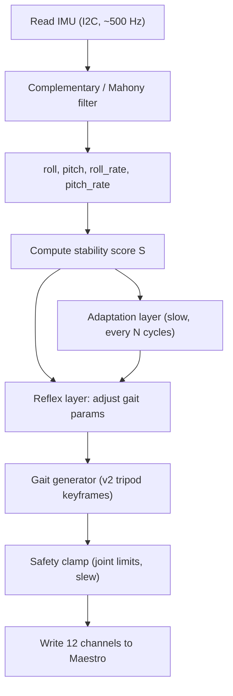

# Architecture: control loop on Teensy 4.1

This document shows how the IMU-based adaptive behaviors from [DESIGN.md](DESIGN.md) map to concrete code running on the Teensy alongside the v2 tripod gait.

## Loop structure



Two timescales run inside the same `loop()`:

| Timescale | Rate | What runs |
|-----------|------|-----------|
| **Fast tick** | Every `INTERP_DELAY` ms (~100 Hz) | IMU read, filter, reflex corrections, gait interpolation step, Maestro write |
| **Slow tick** | Every full gait cycle (~0.5--1 s) | Stability score windowed average, adaptation parameter update, optional EEPROM save |

## IMU filter

A complementary filter fuses accelerometer (noisy but drift-free) and gyroscope (clean but drifts) into roll and pitch estimates. On Teensy 4.1 (600 MHz Cortex-M7), this costs negligible cycles.

```
// Called every fast tick (dt ~ 10 ms or faster if IMU is polled at higher rate)
alpha = 0.98   // tuning knob: higher = trust gyro more, slower drift correction

accel_roll  = atan2(ay, az)
accel_pitch = atan2(-ax, sqrt(ay*ay + az*az))

roll  = alpha * (roll  + gx * dt) + (1 - alpha) * accel_roll
pitch = alpha * (pitch + gy * dt) + (1 - alpha) * accel_pitch

roll_rate  = gx   // or high-pass filtered gyro
pitch_rate = gy
```

Reference: complementary filter for embedded robots ([Zhang et al., 2021](https://www.mdpi.com/2072-666X/12/11/1373)).

For a Mahony filter (better under vibration), replace the linear blend with a proportional-integral correction on the cross product between measured and estimated gravity. Either works for this project; complementary is simpler to start.

## Stability score

A single scalar summarizing "how unstable is the robot right now":

```
S = w1 * |roll| + w2 * |pitch| + w3 * |roll_rate| + w4 * |pitch_rate|
```

Default weights (tune empirically):

| Weight | Default | Rationale |
|--------|---------|-----------|
| w1 | 1.0 | Roll angle (rad) |
| w2 | 1.0 | Pitch angle (rad) |
| w3 | 0.3 | Roll rate (rad/s); scale so units are comparable to angle |
| w4 | 0.3 | Pitch rate (rad/s) |

For the adaptation layer, also compute **windowed RMS** over the last `M` gait cycles:

```
S_rms = sqrt( (1/N) * sum(S_i^2) )   // N = samples in window
```

## Tuneable gait parameters

These v2 constants (currently `const int` in [hexapod_walking_v2.ino](../firmware/hexapod_walking_v2/hexapod_walking_v2.ino)) become **runtime variables** that the reflex and adaptation layers can adjust:

| Parameter | v2 default | What it controls | Adaptation knob |
|-----------|-----------|------------------|-----------------|
| `LIFT_FLEX` | -120 | Step height (how far the foot lifts in swing) | Increase magnitude on rough terrain |
| `FRONT_SWING_ABD` | 110 | Front stride length | Scale down when unstable |
| `MID_SWING_ABD` | 85 | Mid stride length | Scale down when unstable |
| `REAR_SWING_ABD` | 110 | Rear stride length | Scale down when unstable |
| `INTERP_DELAY` | 10 | Speed of each interpolation step (ms) | Increase to slow gait |
| `LIFT_STEPS` | 10 | Lift sub-phase duration | Increase for more cautious lift |
| `SWING_STEPS` | 16 | Swing sub-phase duration | Increase to slow swing |
| `START_FLEX` | 1400 | Neutral body height | Per-leg bias for leveling |
| `PUSH_FLEX` | 1650 | Stance push depth | Reduce if legs bottom out on slopes |
| Gait mode | tripod | Pattern selection | Switch to slower pattern when S high |

In firmware these become fields in a `GaitState` struct:

```cpp
struct GaitState {
    int lift_flex;
    int push_flex;
    int start_flex;
    float stride_scale;      // 0.0 .. 1.0, multiplies SWING_ABD / PUSH_ABD
    float step_height_scale; // 0.5 .. 2.0, multiplies lift_flex magnitude
    int interp_delay;
    int lift_steps;
    int swing_steps;
    int plant_steps;
    int push_steps;
};
```

## Reflex rules (Level 1 behaviors)

### Roll/pitch stabilization (Behavior 1)

Distribute a per-leg flex bias so the body levels:

```
// Left legs: FL (ch 1), ML (ch 5), RL (ch 9)
// Right legs: FR (ch 3), MR (ch 7), RR (ch 11)

roll_correction = K_roll * roll    // positive roll = leaning right

left_flex_bias  = +roll_correction   // left legs push harder (more flex = more down)
right_flex_bias = -roll_correction   // right legs push less

// Front legs: FL (ch 1), FR (ch 3)
// Rear legs:  RL (ch 9), RR (ch 11)

pitch_correction = K_pitch * pitch   // positive pitch = nose down

front_flex_bias = -pitch_correction  // front legs push less
rear_flex_bias  = +pitch_correction  // rear legs push harder
```

Each leg's flex target becomes `base_flex + left_or_right_bias + front_or_rear_bias`. Clamp the result to safe range.

### Angular-velocity damping (Behavior 2)

Add a derivative term alongside the proportional roll/pitch correction:

```
roll_correction  = K_roll * roll  + K_droll * roll_rate
pitch_correction = K_pitch * pitch + K_dpitch * pitch_rate
```

This makes the reflex anticipatory: it reacts to the *rate* of tipping before the angle grows large.

### Cautious mode trigger (Behavior 3)

```
if (S_rms > S_CAUTIOUS_THRESH for N_CAUTIOUS_CYCLES consecutive cycles):
    stride_scale    *= 0.7      // shorten stride
    interp_delay    += 3        // slow down
    step_height_scale *= 1.2    // lift higher for safety
    // optionally switch to ripple or wave gait

if (S_rms < S_NORMAL_THRESH for N_NORMAL_CYCLES):
    gradually restore defaults
```

Hysteresis between thresholds prevents rapid switching.

### Terrain leveling (Behavior 4)

Same math as Behavior 1 but applied to `START_FLEX` rather than transient bias:

```
front_start_flex = START_FLEX - K_level * pitch
rear_start_flex  = START_FLEX + K_level * pitch
left_start_flex  = START_FLEX + K_level * roll
right_start_flex = START_FLEX - K_level * roll
```

This shifts the **neutral standing height** per leg pair so the chassis stays level on a slope.

### Push recovery (Behavior 9)

```
if (|roll_rate| > PUSH_THRESH or |pitch_rate| > PUSH_THRESH):
    enter RECOVERY mode for 2 gait cycles:
        stride_scale     = 0.5
        interp_delay     += 5
        step_height_scale = 1.5
        start_flex       += 100    // lower body
    then ramp back to normal over 2 more cycles
```

## Adaptation layer (Level 3 online learning)

### Parameter vector

Five scalars the robot learns online:

```
theta = { K_roll, K_pitch, stride_scale_base, step_height_scale_base, freq_scale }
```

These set the **baseline** for reflex gains and gait shape; the reflex layer still applies instantaneous corrections on top.

### Cost function

Evaluated once per gait cycle (or per `M`-cycle window):

```
J = a * RMS(roll)
  + b * RMS(pitch)
  + c * mean(|roll_rate| + |pitch_rate|)
  + d * gait_cycle_count_penalty       // penalize if fewer cycles completed (fell)
  // - e * forward_progress             // if available from secondary sensor or stride count
```

Without a forward-progress sensor, omit the last term and accept that the robot optimizes for stability only. Forward progress can be approximated coarsely from stride count times stride_scale.

### Update rule

**SPSA (Simultaneous Perturbation Stochastic Approximation):** perturb all 5 parameters with random +/- delta, run one window, measure J; perturb the other way, measure J; estimate gradient; step.

```
delta = random_signs(5) * perturbation_size

theta_plus  = theta + delta
theta_minus = theta - delta

// Run M gait cycles with theta_plus, measure J_plus
// Run M gait cycles with theta_minus, measure J_minus

gradient_estimate = (J_plus - J_minus) / (2 * delta)   // element-wise
theta = theta - learning_rate * gradient_estimate

// Clamp theta to safe bounds
```

Each "trial" is `M` gait cycles (~5--10 seconds). The robot tries two parameter sets, keeps the better direction, and slowly converges.

**Alternative: epsilon-greedy bandit** over a discretized grid of parameter combos (simpler, no gradient, works well for 5 dimensions if the grid is coarse).

### EEPROM persistence

```
if (J_current < J_best):
    J_best = J_current
    theta_best = theta
    save theta_best to EEPROM (same pattern as existing hexapod_walking_rl EEPROM code)
```

On boot, load `theta_best` from EEPROM as starting point.

## Timing budget

All times estimated for Teensy 4.1 (600 MHz Cortex-M7, hardware FPU):

| Task | Time per call | Frequency |
|------|---------------|-----------|
| IMU read (I2C @ 400 kHz) | ~0.5 ms | Every fast tick |
| Complementary filter | ~0.01 ms | Every fast tick |
| Stability score + reflex math | ~0.05 ms | Every fast tick |
| Gait interpolation + buildPose | ~0.05 ms | Every fast tick |
| Maestro write (12 channels) | ~1.5 ms | Every fast tick |
| **Total per fast tick** | **~2.1 ms** | |
| Available budget per tick | 10 ms (`INTERP_DELAY`) | |
| **Headroom** | **~7.9 ms** | |

The adaptation layer runs once per gait cycle (every ~500--1000 ms) and adds negligible cost (a few multiplies and one EEPROM write occasionally).

## Safety

All adaptive adjustments are bounded:

| Parameter | Hard min | Hard max | Max change per cycle |
|-----------|----------|----------|---------------------|
| `lift_flex` | -400 | 0 | 50 per cycle |
| `push_flex` | 1200 | 1800 | 50 per cycle |
| `start_flex` | 1000 | 1600 | 30 per cycle |
| `stride_scale` | 0.3 | 1.0 | 0.1 per cycle |
| `step_height_scale` | 0.5 | 2.0 | 0.2 per cycle |
| `interp_delay` | 5 | 25 | 2 per cycle |
| `K_roll`, `K_pitch` | 0.0 | 500.0 | 50 per cycle |

**Fall detection:** if `|roll| > 45 deg` or `|pitch| > 45 deg`, freeze all servos at current position and enter safe mode (stop gait, print diagnostic over Serial). Require manual restart or Serial command to resume.

**Slew rate:** no parameter jumps from one gait cycle to the next beyond the max-change column. Ramp toward target values.
